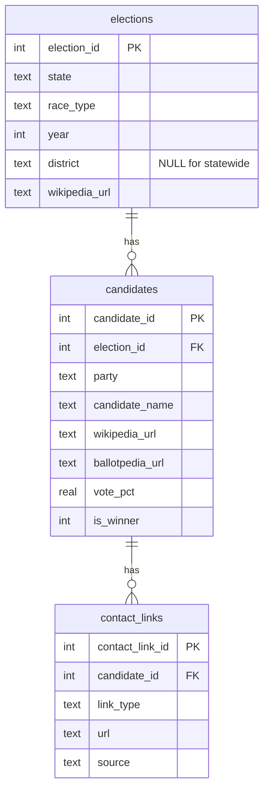

# camplinks

Scrape and enrich US political election data from Wikipedia and Ballotpedia into a normalized SQLite database.

## Data Model



**`link_type` values:** `campaign_site`, `campaign_facebook`, `campaign_x`, `campaign_instagram`, `personal_website`, `personal_facebook`, `personal_linkedin`

**`source` values:** `wikipedia`, `ballotpedia`, `web_search`

## Quickstart

```bash
# Install
uv sync

# Scrape 2024 House races and enrich with contact info
python -m camplinks --year 2024 --race house

# Scrape 2024 Senate races
python -m camplinks --year 2024 --race senate

# Run all registered race types
python -m camplinks --year 2024 --race all
```

The database is written to `camplinks.db` by default. Override with `--db path/to/db`.

## Pipeline Stages

The pipeline runs three stages in order. Each stage is idempotent (safe to re-run).

| Stage | What it does | Data source |
|-------|-------------|-------------|
| **scrape** | Fetch election results from Wikipedia | Wikipedia state election pages |
| **enrich** | Extract campaign websites from candidate Wikipedia pages | Wikipedia candidate infoboxes |
| **search** | Find missing contact info via Ballotpedia and web search | Ballotpedia + DuckDuckGo |

Run individual stages with `--stage`:

```bash
python -m camplinks --year 2024 --race house --stage scrape
python -m camplinks --year 2024 --race house --stage enrich
python -m camplinks --year 2024 --race house --stage search
```

## Querying the Database

```python
import sqlite3

conn = sqlite3.connect("camplinks.db")
conn.row_factory = sqlite3.Row

# All 2024 House winners with their campaign sites
rows = conn.execute("""
    SELECT c.candidate_name, c.party, e.state, e.district, cl.url
    FROM candidates c
    JOIN elections e ON c.election_id = e.election_id
    LEFT JOIN contact_links cl ON c.candidate_id = cl.candidate_id
        AND cl.link_type = 'campaign_site'
    WHERE c.is_winner = 1 AND e.year = 2024 AND e.race_type = 'US House'
    ORDER BY e.state, e.district
""").fetchall()

for r in rows:
    print(f"{r['state']}-{r['district']}: {r['candidate_name']} ({r['party']}) - {r['url']}")
```

Or with Polars:

```python
import polars as pl

df = pl.read_database(
    "SELECT * FROM candidates c JOIN elections e ON c.election_id = e.election_id",
    "sqlite:///camplinks.db",
)
```

## Adding a New Race Type

See [USAGE.md](USAGE.md) for a walkthrough with examples.

## Development

```bash
uv sync
pytest tests/
mypy camplinks/
ruff check .
```

## Contributing

See [CONTRIBUTING.md](CONTRIBUTING.md) for setup instructions and guidelines.

## License

[MIT](LICENSE)
