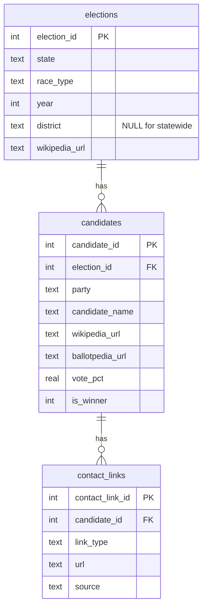

# camplinks Usage Guide

This guide walks through common workflows for collecting political election data with camplinks.

## Vignette 1: Scraping 2024 House Races (Full Pipeline)

The simplest use case: scrape all 437 US House races for 2024, then enrich every candidate with their campaign website and social media links.

```bash
python -m camplinks --year 2024 --race house
```

This runs all three stages:

1. **Scrape** - Fetches the [2024 House elections index](https://en.wikipedia.org/wiki/2024_United_States_House_of_Representatives_elections) on Wikipedia, follows links to each state page, and parses candidate tables.
2. **Enrich** - For every candidate with a Wikipedia page, fetches their page and extracts the campaign website from the infobox.
3. **Search** - For candidates still missing a campaign website, searches Ballotpedia (via DuckDuckGo) and extracts all contact links from the Ballotpedia infobox. Falls back to general web search with heuristic scoring.

Results land in `camplinks.db`. Inspect them:

```bash
sqlite3 camplinks.db "SELECT COUNT(*) FROM elections WHERE race_type='US House' AND year=2024;"
# 437

sqlite3 camplinks.db "SELECT COUNT(*) FROM candidates c JOIN elections e ON c.election_id=e.election_id WHERE e.year=2024;"
# ~840

sqlite3 camplinks.db "SELECT link_type, COUNT(*) FROM contact_links GROUP BY link_type;"
```

## Vignette 2: Scraping 2024 Senate Races

Senate races work exactly the same way:

```bash
python -m camplinks --year 2024 --race senate
```

This scrapes the [2024 Senate elections index](https://en.wikipedia.org/wiki/2024_United_States_Senate_elections), follows links to each state race page, and parses the general election table. Senate races are statewide, so `district` is NULL in the database.

You can run both House and Senate in one command:

```bash
python -m camplinks --year 2024 --race all
```

## Vignette 3: Running Individual Stages

If the full pipeline takes too long (the search stage can be slow due to rate limiting), you can run stages separately:

```bash
# Just scrape (fast, ~5 minutes)
python -m camplinks --year 2024 --race house --stage scrape

# Enrich from Wikipedia (moderate, depends on candidate count)
python -m camplinks --year 2024 --race house --stage enrich

# Search Ballotpedia + web (slow, has rate limiting)
python -m camplinks --year 2024 --race house --stage search
```

Each stage is **idempotent** - it uses upsert semantics, so re-running a stage won't duplicate data. The search stage also uses a JSON cache (`campaign_search_cache.json`) so interrupted runs resume where they left off.

## Vignette 4: Scraping a Different Election Year

camplinks supports any recent election cycle. Wikipedia has pages going back decades, though table formats may vary.

```bash
python -m camplinks --year 2022 --race house
python -m camplinks --year 2020 --race senate
```

All data goes into the same database, keyed by year. You can query across years:

```python
import sqlite3

conn = sqlite3.connect("camplinks.db")
conn.row_factory = sqlite3.Row

# Compare candidate counts across years
rows = conn.execute("""
    SELECT e.year, e.race_type, COUNT(DISTINCT c.candidate_id) as candidates
    FROM elections e
    JOIN candidates c ON e.election_id = c.election_id
    GROUP BY e.year, e.race_type
    ORDER BY e.year DESC
""").fetchall()

for r in rows:
    print(f"{r['year']} {r['race_type']}: {r['candidates']} candidates")
```

## Vignette 5: Adding a New Race Type (e.g., Governor)

To add support for a new race type, create a scraper class in `camplinks/scrapers/`. Here's the pattern:

### Step 1: Create the scraper file

Create `camplinks/scrapers/governor.py`:

```python
"""Wikipedia scraper for US gubernatorial elections."""

from __future__ import annotations

import re

from bs4 import BeautifulSoup

from camplinks.http import BASE_URL
from camplinks.models import Candidate, Election
from camplinks.scrapers import register_scraper
from camplinks.scrapers.base import BaseScraper
from camplinks.wiki_parsing import (
    is_general_election_table,
    parse_candidate_row,
)


class GovernorScraper(BaseScraper):
    """Scraper for US gubernatorial elections."""

    race_type = "Governor"

    def build_index_url(self, year: int) -> str:
        return f"{BASE_URL}/wiki/{year}_United_States_gubernatorial_elections"

    def collect_state_urls(
        self, soup: BeautifulSoup, year: int
    ) -> list[tuple[str, str]]:
        pattern = re.compile(
            rf"/wiki/{year}_\w+_gubernatorial_election"
        )
        seen: set[str] = set()
        results: list[tuple[str, str]] = []
        for anchor in soup.find_all("a", href=pattern):
            href = str(anchor["href"])
            if href in seen:
                continue
            seen.add(href)
            # Extract state from URL (e.g., "2024_Montana_gubernatorial_election")
            parts = href.split("/wiki/")[1].split("_gubernatorial")[0]
            state_name = "_".join(parts.split("_")[1:]).replace("_", " ")
            results.append((state_name, f"{BASE_URL}{href}"))
        return results

    def parse_state_page(
        self,
        state: str,
        soup: BeautifulSoup,
        year: int,
    ) -> list[tuple[Election, list[Candidate]]]:
        # Governor pages use the same wikitable plainrowheaders format
        tables = soup.find_all(
            "table",
            class_=lambda c: c and "wikitable" in c and "plainrowheaders" in c,
        )
        for table in tables:
            if not is_general_election_table(table):
                continue

            candidates: list[Candidate] = []
            for row in table.find_all("tr", class_="vcard"):
                parsed = parse_candidate_row(row)
                if parsed and parsed.get("name"):
                    candidates.append(
                        Candidate(
                            party=str(parsed["party"]),
                            candidate_name=str(parsed["name"]),
                            wikipedia_url=str(parsed.get("wiki_url", "")),
                            vote_pct=float(vp)
                            if (vp := parsed.get("vote_pct")) is not None
                            and isinstance(vp, (int, float))
                            else None,
                            is_winner=bool(parsed.get("is_winner", False)),
                        )
                    )

            if candidates:
                election = Election(
                    state=state,
                    race_type="Governor",
                    year=year,
                    district=None,  # statewide
                )
                return [(election, candidates)]

        return []


# This line registers the scraper so the CLI can find it
register_scraper("governor", GovernorScraper)
```

### Step 2: Register the import

Add one line to `camplinks/__main__.py`:

```python
import camplinks.scrapers.governor  # noqa: F401
```

### Step 3: Run it

```bash
python -m camplinks --year 2024 --race governor
```

That's it. The enrichment and search stages work automatically for any race type since they operate on the candidates table, not on race-specific logic.

## Vignette 6: Exporting Data

### To CSV

```python
import polars as pl

# Export all candidates with their contact links
df = pl.read_database("""
    SELECT
        e.state, e.race_type, e.year, e.district,
        c.party, c.candidate_name, c.vote_pct, c.is_winner,
        cl.link_type, cl.url
    FROM candidates c
    JOIN elections e ON c.election_id = e.election_id
    LEFT JOIN contact_links cl ON c.candidate_id = cl.candidate_id
    WHERE e.year = 2024
    ORDER BY e.state, e.race_type, e.district
""", "sqlite:///camplinks.db")

df.write_csv("export_2024.csv")
```

### To a pivoted wide format (one row per candidate)

```python
import polars as pl

# Read normalized data
candidates = pl.read_database(
    "SELECT * FROM candidates c JOIN elections e ON c.election_id = e.election_id WHERE e.year = 2024",
    "sqlite:///camplinks.db",
)
links = pl.read_database(
    "SELECT * FROM contact_links",
    "sqlite:///camplinks.db",
)

# Pivot contact links wide
wide_links = links.pivot(on="link_type", index="candidate_id", values="url")

# Join
result = candidates.join(wide_links, on="candidate_id", how="left")
result.write_csv("candidates_wide_2024.csv")
```

## Database Schema Reference


